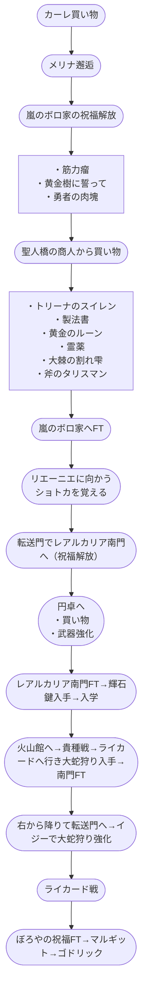

# Elden Ring Any% Glitchless Serpent-Hunter

## おおまかな流れ

- セットアップ
  - カーレから買い物
  - メリメリ邂逅
  - 嵐のボロや
    - 祝福
  - 筋力こぶ取得
  - 黄金樹に誓って取得
  - 勇者の肉塊
  - 聖人橋？のとこの商人から買い物
  - 製法書取得
  - 霊薬取得
  - 黄金樹からアレ取得
  - 斧のタリスマン取得
  - ぼろやへFT
  - リエーニエに向かう
    - 初とかで下に降りる
  - 何かワープする
  - レアルカリア南門の祝福
    - 円卓へ
      - 買い物
      - 打ち刀強化
  - 輝石鍵入手
  - 入学
    - 火山かんへ
    - 奇手戦
    - ライカードへ
    - おろち狩り取って南門へ
    - 右から降りて転送門
    - イジーでおろち狩り強化
- ライカード戦
- ゴドリック城
  - ぼろやの祝福
  - マルギット戦
  - 正門からこんにちわ
  - ゴドリック
- アルター高原へ
  - 奇手のとこにワープ
  - 降りてって祝福つける
  - 人形戦
- 竜のツリーガード
  - セットアップちゃんと覚えるOr倒す

## フローチャート

## チャート

### Setup

- カーレ買い物
